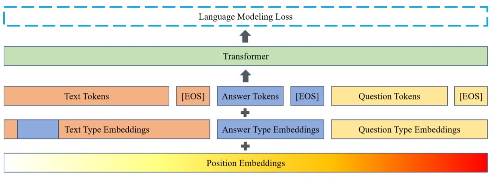

# Generatig synthetic questions for improved knowledge distillation of extractive QA models

Synthetic question-answer generation can be used to leverage large amounts of unlabeled text to improve the quality of existing QA models, or create training data from a text corpus of a specific theme to train QA models for specialised applications. One way to do this, described in ["Training Question Answering Models From Synthetic Data"](https://arxiv.org/pdf/2002.09599.pdf), requires training BERT to perform answer generation, conditioned on context, training GPT2 to generate questions, conditioned on context and generated answer, and a filtration step that checks if the genrated question is relevant.

In this repo, I followed the above paper to generate synthetic questions for context passages from wikipedia pages. Such context-question pairs can be used in the kontext of knowledge distillation, where answer spans are not necessary. Custom modifications that improve or speed up the process include:
* training question generation model on 'question loss' that includes LM loss of only the question span. This improves the generation quality and reduces the number of questions filtered out due to stop-word filtration;
* question filtration that rates how likely is it that the question has an answer in the corresponding context. It uses BERT model for QA pretrained on SQuAD-v2.0 dataset. Generated logits can be saved and used as teacher labels for knowledge distillation.


## How to run the code

### Training:

The code is based mainly on transformers and nlp libraries from huggingface, so make sure to have those. To use half-precision, install apex from NVIDIA. After cloning this repo, run `python data_processor.py` which will download the SQuAD-v2.0 dataset.

* To train the answer generator run:
```
$ python train_answer_generator.py \
    --model_path bert-large-uncased \
    --output_dir answer_generator_bert-large-uncased \
    --data_dir data \
    --max_seq_length 512 \
    --max_ans_length 64 \
    --do_lower_case \
    --num_train_epochs 2 \
    --train_batch_size 4 \
    --dev_batch_size 8 \
    --gradient_accumulation_steps 8 \
    --dynamic_batching \
    --learning_rate 1e-5 \
    --weight_decay 0.01 \
    --train_logging_steps 10 \
    --dev_logging_steps 250 \
    --save_steps 1000 \
    --evaluate_during_training \
    --threads 2 \
    --fp16 \
    --fp16_opt_level O2 \
    --overwrite_output_dir \
```
or simply modify and run `run_train_answer_generator.sh`

* To train question generator run:
```
$ python train_question_generator_q-loss.py \
    --model_path gpt2-medium \
    --output_dir question_generator_gpt2-medium \
    --data_dir data \
    --max_seq_length 448 \
    --max_ans_length 64 \
    --do_lower_case \
    --num_train_epochs 6 \
    --train_batch_size 2 \
    --dev_batch_size 4 \
    --gradient_accumulation_steps 16 \
    --dynamic_batching \
    --learning_rate 2e-5 \
    --weight_decay 0.01 \
    --train_logging_steps 10 \
    --dev_logging_steps 500 \
    --save_steps 1000 \
    --evaluate_during_training \
    --threads 2 \
    --fp16 \
    --fp16_opt_level O2 \
    --overwrite_output_dir \
```
or simply modify and run `run_train_question_generator.sh`

### Generation:

Generation from pretrained models is split into two steps: answer generation followed by question generation:
* answer generation: run `run_answer_generator.sh` or
```
$ python answer_generator.py \
	--model_path answer_generator_bert-large-uncased \
	--output_dir generated_answers \
	--max_context_length 192 \
	--max_ans_length 30 \
	--num_examples 1000000  \
	--ans_per_context 5 \
	--do_lower_case \
	--batch_size 128\
	--save_steps 10000 \
	--threads 1 \
	--overwrite_output_dir \
```
* question generation: run `run_question_generator.sh` or
```
$ python question_generator.py \
	--question_generation_model question_generator_gpt2-medium \
	--answering_model deepset/bert-large-uncased-whole-word-masking-squad2 \
	--output_dir generated_questions \
	--generated_answers_path generated_answers \
	--max_q_length 64 \
	--num_pregenerated_questions 16 \
	--num_answerable_questions 6 \
	--num_unanswerable_questions 1 \
	--save_steps 1000 \
```

## Question filtration?
In the original publication, roundtrip filtration is applied, wherein two questions are generator for each context-answer pair. Then a pretrained QA BERT model is applied to generate answers for each question. If at least one answer agrees with the original answer from the context, then both questions are kept as valid. The reasoning is that if one question is generated, then a lot of the time it will be discarded, even though it is still a valid question and applied to the context, though does not really produce the same answer that was used for its generation.

In this repo I take this idea further, and conclude that roundtrip filtration is not necessary when creating questions for knowledge distillation. What is needed is a fair ratio between generated unswerable and unanswerable questions. A pretrained BERT model can be used for it. The probability asigned to the first token, the '[CLS]' token, can be treated as a proxy of question answerability. Therefore, for each context-answer pain let's generate a large number of question candidates and rate them as either unswerable or unanswerable: a question is judged unanswerable if the probability of the '[CLS]' token is larger than for any other token in the sequence, both as start and end positions of the answer span. Then select questions from both subsets with the smallest probability of the '[CLS]' token - this way we get questions that are most likely to be answerable, as well as some unanswerable questions that were challenging to the model.

## Question loss improves question generation

<p style="max-width: 50%; float: right;">

</p>
Training question generation model is done by finetuning a GPT2 model on a language modeling task. The model receives sequences constructed from context, answer and question, as seen on the right. In the paper, loss is averaged over the whole sequence, hence the model learns the language structures not only from the question but also from the provided context. The special question tokens and token type indices help in distinguishing different parts of input and also locate the answer within the context.

However, restricting the loss to take into account tokens only from the question seems to produce better questions: the question loss for a model trained in this way is lower than for a model trained on a loss from the whole sequence. Also, generated questions are much more likely to contain the end-of-question token and much less likely to return that token prematurely, which overall generates more syntactically correct questions.


## To do
* Compare with knowledge distillation on other synthetic datasets.